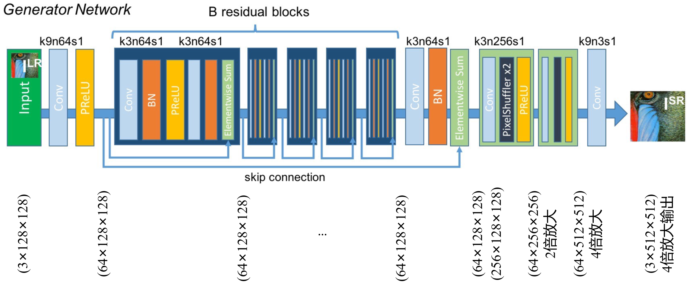
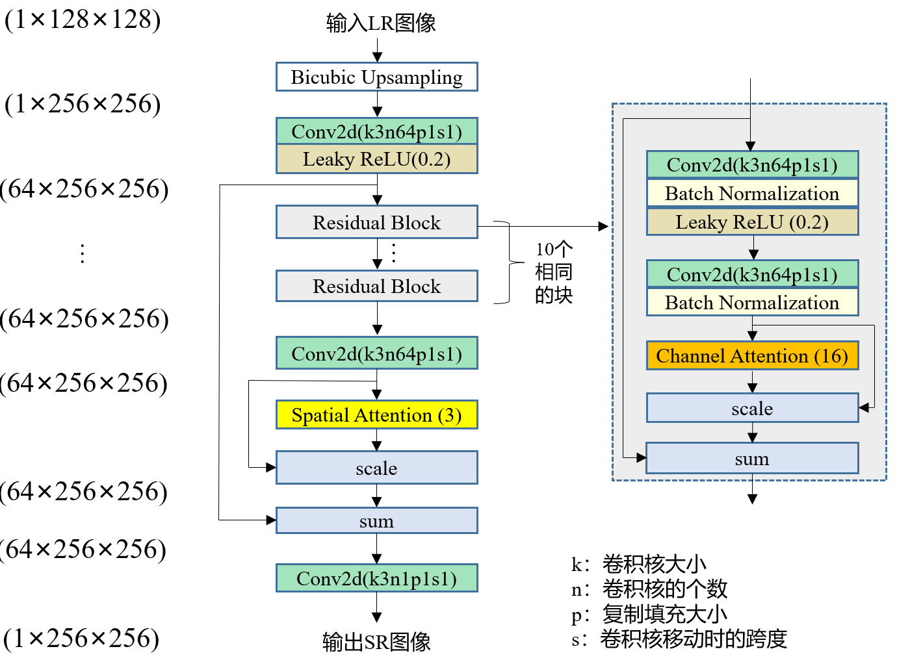
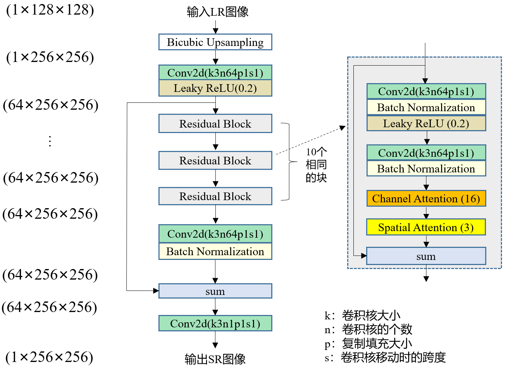
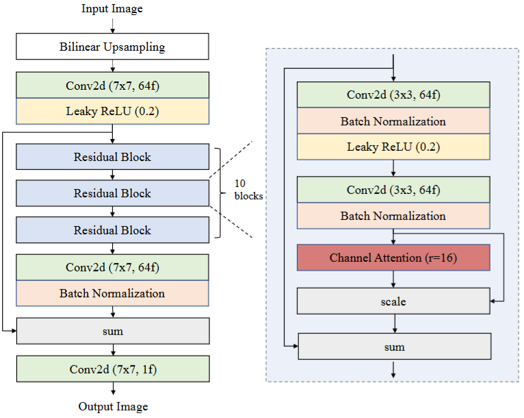
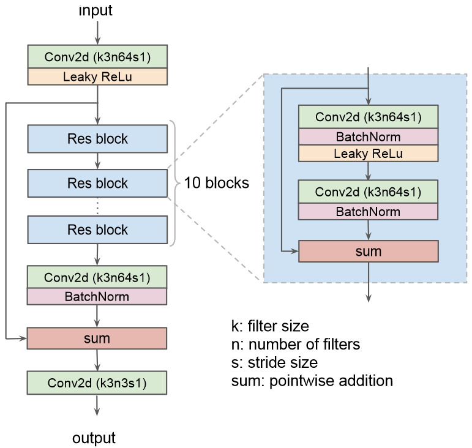

# 训练
输入全色图像：HR（256×256）与LR（128×128），其中LR由HR经退化模型得到

# 训练时的网络中的特征图大小变化

## net_SRResNet网络结构图与特征图变化

## net_cnn1网络结构图与特征图变化

## net_cnn2网络结构图与特征图变化

## net_cnn_neo网络结构图与特征图变化

## net_cnn_geoeye网络结构图与特征图变化

# 测试
输入全色图像，由于是全卷积网络，所以输入图像不必是128*128，但是该网络只能放大两倍